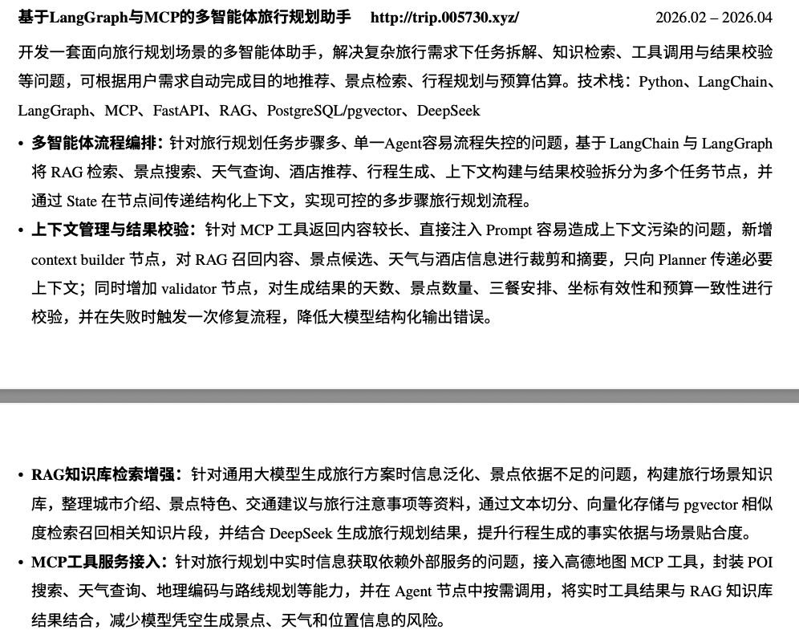

# LangGraph 智能旅行助手

基于 LangGraph 与 MCP 的多智能体旅行规划助手。用户输入目的地、日期、交通方式、住宿偏好和旅行兴趣后，系统会调用地图、天气、POI 等工具，并生成结构化的多日旅行计划。

## 在线体验

[打开旅行规划助手](http://005730.xyz/trip)

## 简历项目描述参考

下面的项目描述可直接用于简历，并可根据实际面试重点调整：

> **基于 LangGraph 与 MCP 的多智能体旅行规划助手**（2026.02 - 2026.04）
>
> 开发一套面向旅行规划场景的多智能体助手，解决复杂旅行需求下的任务拆解、知识检索、工具调用与结果校验问题，可根据用户需求自动完成目的地推荐、景点检索、行程规划与预算估算。技术栈：Python、LangChain、LangGraph、MCP、FastAPI、RAG、PostgreSQL/pgvector、DeepSeek。
>
> - **多智能体流程编排：** 针对旅行规划任务步骤多、单一 Agent 容易失控的问题，基于 LangChain 与 LangGraph 将 RAG 检索、景点搜索、天气查询、酒店推荐、行程生成、上下文构建与结果校验拆分为多个任务节点，并通过 State 在节点间传递结构化上下文，实现可控的多步骤旅行规划流程。
> - **上下文管理与结果校验：** 针对 MCP 工具返回内容较长、直接注入 Prompt 容易造成上下文污染的问题，新增 context builder 节点，对 RAG 召回内容、景点候选、天气与酒店信息进行裁剪和摘要，只向 Planner 传递必要上下文；同时增加 validator 节点，对生成结果的天数、景点数量、三餐安排、坐标有效性和预算一致性进行校验，并在失败时触发一次修复流程，降低大模型结构化输出错误。
> - **RAG 知识库检索增强：** 构建旅行场景知识库，整理城市介绍、景点特色、交通建议与旅行注意事项等资料，通过文本切分、向量化存储与 pgvector 相似度检索召回相关知识片段，并结合 DeepSeek 生成旅行规划结果，提升行程生成的事实依据与场景贴合度。
> - **MCP 工具服务接入：** 接入高德地图 MCP 工具，封装 POI 搜索、天气查询、地理编码与路线规划等能力，并在 Agent 节点中按需调用，将实时工具结果与 RAG 知识库结果结合，减少模型凭空生成景点、天气和位置信息的风险。

项目描述排版示例：



## 技术栈

后端：

- FastAPI
- LangChain
- LangGraph
- langchain-mcp-adapters
- 高德地图 MCP Server
- PostgreSQL / pgvector
- OpenAI-compatible LLM，如 DeepSeek
- Pydantic

前端：

- Vue 3
- TypeScript
- Vite
- Ant Design Vue
- Axios

## 后端主流程

```text
POST /api/trip/plan
  -> trip.py 接收 TripRequest
  -> get_trip_planner_agent()
  -> LangGraphTripPlanner.plan_trip()
  -> retrieve_knowledge
  -> search_attractions
  -> query_weather
  -> search_hotels
  -> plan_itinerary
  -> TripPlanResponse
```

核心文件：

- `backend/app/api/main.py`：FastAPI 应用入口与路由注册
- `backend/app/api/routes/trip.py`：旅行规划接口
- `backend/app/agents/trip_planner_agent.py`：LangGraph 多节点规划流程
- `backend/app/services/amap_service.py`：高德地图 MCP 工具封装
- `backend/app/services/rag_service.py`：PostgreSQL/pgvector RAG 检索增强
- `backend/app/services/llm_service.py`：LLM 客户端初始化
- `backend/app/models/schemas.py`：请求、响应与行程结构定义
- `backend/scripts/ingest_travel_guides.py`：旅行知识库入库脚本

## RAG 知识库

项目使用 `backend/data/travel_guides/*.md` 作为旅行知识库来源。入库流程：

```text
markdown攻略
  -> 文本切分
  -> embedding向量化
  -> PostgreSQL/pgvector存储
  -> 按用户城市和偏好相似度检索
  -> 注入最终行程规划prompt
```

首次使用 RAG 前，需要 PostgreSQL 已安装 `pgvector` 扩展，然后执行：

```bash
cd backend
python scripts/ingest_travel_guides.py
```

本地开发可以使用 Homebrew 安装并启动数据库：

```bash
brew install postgresql@17 pgvector
brew services start postgresql@17
/opt/homebrew/opt/postgresql@17/bin/createdb travel_planner
```

如果未配置 `DATABASE_URL`，系统会自动跳过 RAG 节点，保留原有 MCP 工具规划流程。默认 `RAG_EMBEDDING_PROVIDER=sentence_transformer`，使用本地下载的 `BAAI/bge-small-zh-v1.5` 中文 embedding 模型；如切换到 `openai`，再配置 `EMBEDDING_API_KEY` 和 `EMBEDDING_BASE_URL`。

## 快速启动

后端：

```bash
cd backend
pip install -r requirements.txt
uvicorn app.api.main:app --reload --host 0.0.0.0 --port 8000
```

前端：

```bash
cd frontend
npm install
npm run dev
```

需要在 `.env` 中配置：

```text
AMAP_API_KEY=
LLM_API_KEY=
LLM_BASE_URL=
LLM_MODEL_ID=
DATABASE_URL=
RAG_EMBEDDING_PROVIDER=sentence_transformer
RAG_EMBEDDING_MODEL=BAAI/bge-small-zh-v1.5
RAG_EMBEDDING_DIMENSIONS=512
```
